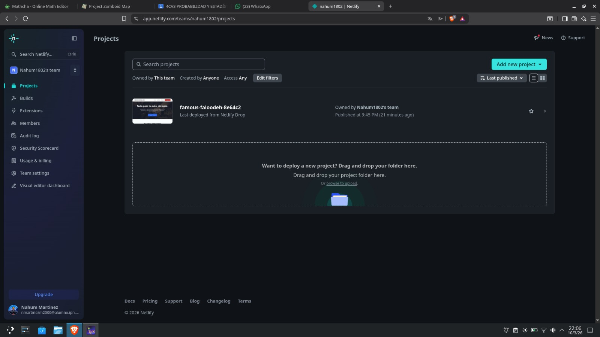

# Refaccionaria Leo #
## Materia ##
Base de Datos.
## Profesor ##
Hurtado Aviles Gabriel.
## Datos del equipo ##
### Integrantes ###
Martinez Marin Nahum.  
Miranda Arredondo Miguel Angel.
### Fecha de entrega ###
10/03/2026.

## URL de la aplicación ##
https://famous-faloodeh-8e64c2.netlify.app/
## URL del repositorio ##
https://github.com/Nahum1802/Refaccionaria-Leo
## Justificación ##
Usamos PostgreSQL junto con Neon y Netlify. En el caso de Neon, observamos que es recomendable para proyectos pequeños o de prueba, ya que permite realizar copias de seguridad y también hacer pruebas sin afectar la base de datos principal gracias a su sistema de branching.
Sin embargo, que sea recomendado para proyectos pequeños no significa que no tenga facilidad de escalabilidad, ya que Neon ofrece una gran facilidad para escalar el proyecto conforme crece.
En el caso de Netlify, lo elegimos como herramienta de deployment porque la conexión con Neon es bastante sencilla y además permite la integración con repositorios de Git, lo que facilita el mantenimiento y el desarrollo del proyecto
## Pasos para el despliegue ##
Paso 1: Iniciar sesion en Netlify (con Google, Github, ect..).  
Paso 2: Ir a la pestaña de "Porjects".  
Paso 3: Dar click en "broswe to upload".  
Paso 4: Poner en una carpeta todo lo que quieras subir.  
Paso 5: Seleccionar la carpeta que hiciste para subir tus archivos.  
Paso 6: Esperar a que te genere tu URL.

## Funcionalidades de la aplicación ##
1. Venta\Consulta de productos.
2. Registro de las entradas o salidas de dinero.
3. Inventario de productos.  

El dueño podrá ver el inventario de los productos en venta y revisar el estado de los pedidos realizados.
Mientras que el cliente podrá ver el catálogo disponible, ya sea de aceites, refacciones, accesorios, etc., junto con la disponibilidad de cada uno. Además, podrá realizar compras en línea, pero deberá registrarse con una cuenta de correo y una contraseña. Posteriormente, tendrá que ingresar una dirección de entrega para que le hagan llegar sus artículos.
## Usos de la aplicación ##
Dueño:
Ingresará a una ventana en la cual podrá ver el inventario de los productos disponibles. Posteriormente, tendrá acceso a otra ventana donde podrá visualizar las ventas realizadas tanto en línea como físicas, junto con sus respectivas descripciones: producto, cantidad, total, número de venta y fecha.

Cliente:
Ingresará a la página principal para dirigirse al apartado de tienda. En la tienda podrá ver el catálogo de los productos disponibles y tendrá la opción de comprarlos. Al momento de seleccionar un producto, el sistema detectará si el usuario tiene una sesión activa; en caso de no ser así, será redirigido a la ventana de registro. Ahí se le pedirá una dirección de correo y una contraseña y, posteriormente, una dirección de envío para poder mandar sus artículos.
